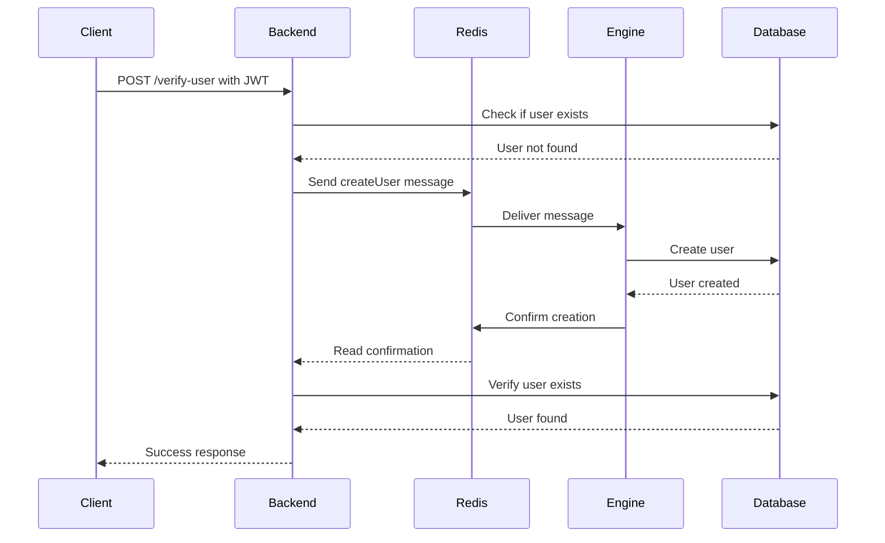

Verifies whether the authenticated user exists in the database. If the user is not found, this endpoint will initiate user creation in the Engine and Database Storage services.

## Authentication

This endpoint requires authentication via JWT token in the Authorization header.

```
Authorization: Bearer <your_jwt_token>
```

## Request Body

This endpoint does not accept a request body. The user ID and email are extracted from the JWT token.

## Response

<ResponseField name="success" type="boolean">
  Indicates if the verification was successful
</ResponseField>

<ResponseField name="exists" type="boolean">
  Indicates if the user exists in the database
</ResponseField>

<ResponseField name="message" type="string">
  Description of the verification result
</ResponseField>

## Examples

### Successful Request (User Exists)

<CodeGroup>
```bash cURL
curl -X POST "http://localhost:8000/api/v1/auth/verify-user" \
  -H "Authorization: Bearer YOUR_JWT_TOKEN"
```

```javascript JavaScript
const verifyUser = async (token) => {
  const response = await fetch('http://localhost:8000/api/v1/auth/verify-user', {
    method: 'POST',
    headers: {
      'Authorization': `Bearer ${token}`
    }
  });
  
  const data = await response.json();
  return data;
};
```

```python Python
import requests

response = requests.post(
    'http://localhost:8000/api/v1/auth/verify-user',
    headers={'Authorization': f'Bearer {your_token}'}
)

result = response.json()
print(result)
```
</CodeGroup>

<ResponseExample>
```json User Exists
{
  "success": true,
  "exists": true,
  "message": "User verified and exists in database"
}
```
</ResponseExample>

### User Creation Flow

When a user is not found in the database:

<ResponseExample>
```json User Being Created
{
  "error": "User not found in database and creation is in progress.",
  "exists": false
}
```
</ResponseExample>

## Error Responses

### Error: No Token Provided

<ResponseExample>
```json No Token
{
  "error": "No token provided."
}
```
</ResponseExample>

### Error: Invalid Token

<ResponseExample>
```json Invalid Token
{
  "error": "Invalid or expired token."
}
```
</ResponseExample>

### Error: Invalid Token Payload

<ResponseExample>
```json Invalid Payload
{
  "error": "Invalid token payload."
}
```
</ResponseExample>

## Implementation Details

This endpoint performs the following operations:

1. **Token Validation**: Verifies the JWT token and extracts user ID and email
2. **Database Check**: Queries the PostgreSQL database for the user
3. **User Creation**: If user not found, sends a message to Redis Streams to create the user
4. **Response Wait**: Waits up to 5 seconds for the Engine to confirm user creation
5. **Verification**: Checks the database again after creation attempt

### User Creation Flow



## Use Cases

### Dashboard User Verification

Use this endpoint when a user navigates to the dashboard to ensure they exist in the system:

```javascript
const ensureDashboardAccess = async (token) => {
  try {
    const result = await fetch('http://localhost:8000/api/v1/auth/verify-user', {
      method: 'POST',
      headers: { 'Authorization': `Bearer ${token}` }
    });
    
    const data = await result.json();
    
    if (data.success && data.exists) {
      // User exists, proceed to dashboard
      return { canAccess: true };
    } else if (!data.exists) {
      // User creation in progress, retry or show loading
      return { canAccess: false, reason: 'User creation in progress' };
    }
  } catch (error) {
    return { canAccess: false, reason: error.message };
  }
};
```

## Related Endpoints

- [Login](/api/auth/login) - Initiate authentication flow
- [Verify](/api/auth/verify) - Complete email verification
- [Ensure User](/api/auth/ensure-user) - Force user creation
