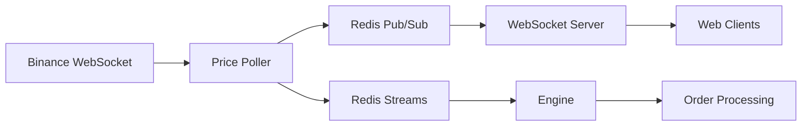
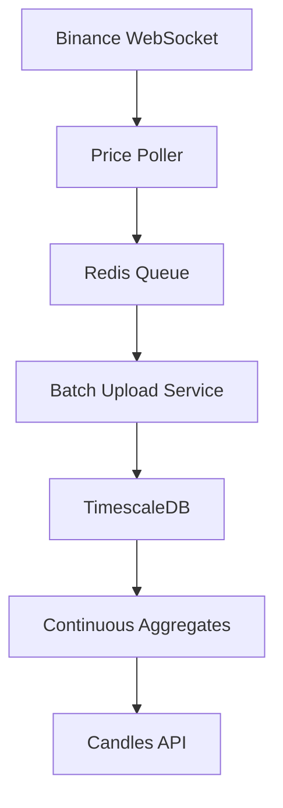

The Exness Trading Platform provides comprehensive market data through multiple channels: real-time WebSocket streams for live prices, REST API for historical data, and TimescaleDB for efficient time-series storage.

## Real-Time Price Streaming

Connect to live market data via WebSocket to receive instant price updates:

<CodeGroup>
```javascript WebSocket Client
// Connect to WebSocket server
const ws = new WebSocket('wss://ws.exness.com');

ws.onopen = () => {
  console.log('Connected to price stream');
};

ws.onmessage = (event) => {
  const priceUpdate = JSON.parse(event.data);
  console.log('Price update:', priceUpdate);
  
  // Update UI with new prices
  updatePriceDisplay(priceUpdate);
};

// Price update format
{
  "asset": "BTC_USDC_PERP",
  "bid": 429700,      // Bid price (with 4 decimal precision)
  "ask": 430300       // Ask price (with 4 decimal precision)
}
```

```typescript WebSocket Server
// apps/Websocket_Server/src/index.ts
import { WebSocketServer } from "ws";
import { pubsubClient } from "@repo/config";

const wss = new WebSocketServer({ port: config.WEBSOCKET_PORT });
const PubsubClient = pubsubClient(config.REDIS_URL);
await PubsubClient.connect();

wss.on("connection", async (socket) => {
  console.log("Client connected");

  // Subscribe to Redis pub/sub for price updates
  await PubsubClient.subscriber(constant.pubsubKey, (data) => {
    // Forward price updates to WebSocket client
    socket.send(JSON.stringify(data));
  });

  socket.on("close", () => {
    console.log("Client disconnected");
  });
});
```
</CodeGroup>

<Info>
The WebSocket server receives prices from Redis Pub/Sub and distributes them to all connected clients in real-time.
</Info>

## Price Data Flow

Market data flows through the platform in this sequence:



### Price Poller Service

The Price Poller connects to Binance and processes raw market data:

<CodeGroup>
```typescript Price Ingestion
// apps/Price_Poller/src/index.ts
import WebSocket from "ws";
import { pubsubClient, redisClient, redisStreams } from "@repo/config";

const ws = new WebSocket(config.BINANCE_WS_URL);
const PubsubClient = pubsubClient(config.REDIS_URL);
const RedisStreams = redisStreams(config.REDIS_URL);

const crypto_trades = ["ETH_USDC_PERP", "SOL_USDC_PERP", "BTC_USDC_PERP"];
const price_updates: PriceUpdate[] = [];

// Subscribe to Binance trade streams
ws.on("open", function open() {
  crypto_trades.forEach((asset) => {
    ws.send(`{"method":"SUBSCRIBE","params":["trade.${asset}"],"id":4}`);
  });
});

ws.on("message", async (data) => {
  const msg = JSON.parse(data.toString());
  
  // Calculate bid/ask with 0.5% spread
  const decimal = 4;
  const asset = msg.data.s.toString();
  const price = Math.floor(Number(msg.data.p) * 10 ** decimal);
  const bidValue = Math.floor((price - price * 0.005) * 10 ** decimal);
  const askValue = Math.floor((price + price * 0.005) * 10 ** decimal);
  
  // Publish to WebSocket clients via Redis Pub/Sub
  const bidAsk = { asset, bid: bidValue, ask: askValue };
  await PubsubClient.publish(
    constant.pubsubKey,
    JSON.stringify(bidAsk)
  );
  
  // Update price_updates array
  const idx = price_updates.findIndex((u) => u.asset === asset);
  if (idx !== -1) {
    price_updates[idx] = { asset, price, bidValue, askValue, decimal };
  } else {
    price_updates.push({ asset, price, bidValue, askValue, decimal });
  }
});

// Send to Engine every 3 seconds
setInterval(async () => {
  await RedisStreams.addToRedisStream(
    constant.redisStream,
    {
      function: "pricePoller",
      message: JSON.stringify(price_updates)
    }
  );
}, 3000);
```

```typescript Type Definition
// packages/types/src/index.ts
export type PriceUpdate = {
  asset: string;        // e.g., "BTC_USDC_PERP"
  price: number;        // Mid price (with decimal precision)
  bidValue: number;     // Sell price (price - 0.5%)
  askValue: number;     // Buy price (price + 0.5%)
  decimal: number;      // Decimal precision (4)
};
```
</CodeGroup>

### Supported Assets

The platform currently supports three perpetual futures:

| Asset | Symbol | Binance Stream |
|-------|--------|----------------|
| Bitcoin | BTC_USDC_PERP | trade.BTC_USDC_PERP |
| Ethereum | ETH_USDC_PERP | trade.ETH_USDC_PERP |
| Solana | SOL_USDC_PERP | trade.SOL_USDC_PERP |

<Note>
Prices include a 0.5% spread between bid and ask to simulate real market conditions.
</Note>

## Historical Candlestick Data

Access OHLCV (Open, High, Low, Close, Volume) data for technical analysis:

<Tabs>
  <Tab title="Request">
    ```bash
    curl "https://api.exness.com/api/v1/candles?symbol=BTCUSDT&interval=1h"
    ```
  </Tab>
  <Tab title="Response">
    ```json
    {
      "symbol": "BTCUSDT",
      "dbSymbol": "BTC_USDC_PERP",
      "interval": "1h",
      "from": "2024-01-01T00:00:00.000Z",
      "to": "2024-03-15T14:30:00.000Z",
      "count": 1825,
      "data": [
        {
          "time": "2024-03-15T14:00:00.000Z",
          "open": 43000,
          "high": 43500,
          "low": 42900,
          "close": 43200,
          "volume": 125.5,
          "trade_count": 3542
        }
      ]
    }
    ```
  </Tab>
</Tabs>

### Available Intervals

| Interval | Description | Default Time Range |
|----------|-------------|-----------------|
| `1m` | 1 minute | Last 1 day |
| `5m` | 5 minutes | Last 7 days |
| `15m` | 15 minutes | Last 14 days |
| `30m` | 30 minutes | Last 1 month |
| `1h` | 1 hour | Last 3 months |
| `4h` | 4 hours | Last 1 year |
| `1d` | 1 day | Last 5 years |

<Tip>
Use shorter intervals (1m, 5m) for scalping strategies and longer intervals (4h, 1d) for swing trading and position analysis.
</Tip>

## Candle Data API

The candles endpoint retrieves data from TimescaleDB with automatic time-range selection:

<CodeGroup>
```typescript Candles Route
// apps/Backend/src/routes/candles.routes.ts
import { Router } from "express";
import { timeScaleDB } from "@repo/timescaledb";

const candleRouter = Router();
const client = timeScaleDB();

const allowedIntervals = ["1m", "5m", "15m", "30m", "1h", "4h", "1d"];

// Symbol mapping from user-facing to database format
const symbolMapping: Record<string, string> = {
  'BTCUSDT': 'BTC_USDC_PERP',
  'ETHUSDT': 'ETH_USDC_PERP',
  'SOLUSDT': 'SOL_USDC_PERP',
};

export const getCandles = async (req: Request, res: Response) => {
  const { symbol, interval } = req.query;

  // Validate parameters
  if (!symbol || !interval) {
    return res.status(400).json({
      error: "Missing required query parameters: symbol and interval"
    });
  }

  if (!allowedIntervals.includes(interval as string)) {
    return res.status(400).json({
      error: "Invalid interval value",
      allowedIntervals
    });
  }

  // Map symbol to database format
  const inputSymbol = (symbol as string).toUpperCase();
  const dbSymbol = symbolMapping[inputSymbol] || inputSymbol;

  // Get default time range for interval
  const { from, to } = getTimeRange(interval as string);

  // Retrieve data from TimescaleDB
  const data = await retrieveData(dbSymbol, interval as string, from, to);

  return res.json({
    symbol: inputSymbol,
    dbSymbol,
    interval,
    from,
    to,
    count: data.length,
    data
  });
};

candleRouter.get("/", getCandles);
```

```typescript Time Range Helper
// Compute default time range for interval
function getTimeRange(interval: string) {
  const to = new Date();
  const from = new Date(to);

  switch (interval) {
    case "1m":
      from.setDate(to.getDate() - 1);      // 1 day
      break;
    case "5m":
      from.setDate(to.getDate() - 7);      // 7 days
      break;
    case "15m":
      from.setDate(to.getDate() - 14);     // 14 days
      break;
    case "30m":
      from.setMonth(to.getMonth() - 1);    // 1 month
      break;
    case "1h":
      from.setMonth(to.getMonth() - 3);    // 3 months
      break;
    case "4h":
      from.setFullYear(to.getFullYear() - 1); // 1 year
      break;
    case "1d":
      from.setFullYear(to.getFullYear() - 5); // 5 years
      break;
    default:
      from.setDate(to.getDate() - 1);
  }

  return {
    from: from.toISOString(),
    to: to.toISOString()
  };
}
```
</CodeGroup>

## TimescaleDB Integration

The platform uses TimescaleDB for efficient time-series data storage:

### Continuous Aggregates

TimescaleDB automatically computes candlesticks using continuous aggregates:

```sql
-- Create continuous aggregate for 1-hour candles
CREATE MATERIALIZED VIEW candles_1h
WITH (timescaledb.continuous) AS
SELECT 
  time_bucket('1 hour', time) AS bucket,
  symbol,
  FIRST(price, time) AS open,
  MAX(price) AS high,
  MIN(price) AS low,
  LAST(price, time) AS close,
  SUM(volume) AS volume,
  COUNT(*) AS trade_count
FROM trades
GROUP BY bucket, symbol;
```

### Querying Candles

The API queries pre-aggregated candles for fast response:

```typescript
async function retrieveData(
  symbol: string,
  interval: string,
  from: string,
  to: string
) {
  const table = `candles_${interval}`;
  
  // Refresh continuous aggregate
  await client.getClient().query(
    `CALL refresh_continuous_aggregate('${table}', $1::timestamptz, $2::timestamptz);`,
    [from, to]
  );

  // Query aggregated data
  const query = `
    SELECT bucket AS time,
           open, high, low, close, volume, trade_count
    FROM ${table}
    WHERE UPPER(symbol) = UPPER($1)
      AND bucket BETWEEN $2::timestamptz AND $3::timestamptz
    ORDER BY bucket ASC;
  `;

  const result = await client.getClient().query(query, [symbol, from, to]);
  return result.rows;
}
```

<Info>
Continuous aggregates are automatically maintained by TimescaleDB, providing instant access to pre-computed candles without scanning raw trade data.
</Info>

## Data Storage Pipeline

Trade data flows from Binance to TimescaleDB:



### Trade Storage

Raw trades are stored in the `trades` table:

```sql
CREATE TABLE trades (
  time TIMESTAMPTZ NOT NULL,
  symbol TEXT NOT NULL,
  price NUMERIC NOT NULL,
  volume NUMERIC NOT NULL,
  trade_id TEXT
);

-- Convert to hypertable for time-series optimization
SELECT create_hypertable('trades', 'time');
```

## Diagnostics

Check database status and available data:

<Tabs>
  <Tab title="Request">
    ```bash
    curl "https://api.exness.com/api/v1/candles/diagnostics"
    ```
  </Tab>
  <Tab title="Response">
    ```json
    {
      "totalTrades": 1500000,
      "symbols": [
        {
          "symbol": "BTC_USDC_PERP",
          "count": 500000,
          "earliest": "2024-01-01T00:00:00.000Z",
          "latest": "2024-03-15T14:30:00.000Z"
        },
        {
          "symbol": "ETH_USDC_PERP",
          "count": 750000,
          "earliest": "2024-01-01T00:00:00.000Z",
          "latest": "2024-03-15T14:30:00.000Z"
        },
        {
          "symbol": "SOL_USDC_PERP",
          "count": 250000,
          "earliest": "2024-01-01T00:00:00.000Z",
          "latest": "2024-03-15T14:30:00.000Z"
        }
      ],
      "continuousAggregates": [
        { "view_name": "candles_1m", "materialized_only": false },
        { "view_name": "candles_5m", "materialized_only": false },
        { "view_name": "candles_15m", "materialized_only": false },
        { "view_name": "candles_30m", "materialized_only": false },
        { "view_name": "candles_1h", "materialized_only": false },
        { "view_name": "candles_4h", "materialized_only": false },
        { "view_name": "candles_1d", "materialized_only": false }
      ]
    }
    ```
  </Tab>
</Tabs>

## Refresh Aggregates

Manually refresh continuous aggregates:

```bash
curl -X POST "https://api.exness.com/api/v1/candles/refresh"
```

<Note>
Aggregates are automatically refreshed when querying candles, but you can trigger a manual refresh for all intervals.
</Note>

## Using Market Data in Your Application

Here's a complete example of connecting to live prices and fetching historical data:

<CodeGroup>
```javascript Live Prices
// Connect to WebSocket for real-time updates
const ws = new WebSocket('wss://ws.exness.com');
const prices = {};

ws.onmessage = (event) => {
  const update = JSON.parse(event.data);
  
  // Store latest prices
  prices[update.asset] = {
    bid: update.bid / 10000,  // Convert to actual price
    ask: update.ask / 10000,
    timestamp: Date.now()
  };
  
  // Update UI
  document.getElementById(`${update.asset}-bid`).textContent = 
    prices[update.asset].bid.toFixed(2);
  document.getElementById(`${update.asset}-ask`).textContent = 
    prices[update.asset].ask.toFixed(2);
};
```

```javascript Historical Chart
// Fetch candle data for chart
async function loadChart(symbol, interval) {
  const response = await fetch(
    `https://api.exness.com/api/v1/candles?symbol=${symbol}&interval=${interval}`
  );
  const result = await response.json();
  
  // Format for charting library (e.g., TradingView)
  const candles = result.data.map(candle => ({
    time: new Date(candle.time).getTime() / 1000,
    open: candle.open / 10000,
    high: candle.high / 10000,
    low: candle.low / 10000,
    close: candle.close / 10000,
    volume: candle.volume
  }));
  
  // Render chart
  chart.setData(candles);
}

// Load 1-hour Bitcoin chart
loadChart('BTCUSDT', '1h');
```
</CodeGroup>

<Tip>
Prices are stored with 4 decimal precision (multiplied by 10000). Remember to divide by 10000 when displaying prices to users.
</Tip>

## Next Steps

<CardGroup cols={2}>
  <Card title="Real-Time Trading" icon="bolt" href="/features/real-time-trading">
    Use live prices to execute trades instantly
  </Card>
  <Card title="Order Management" icon="list" href="/features/order-management">
    Monitor your positions with real-time P/L
  </Card>
</CardGroup>