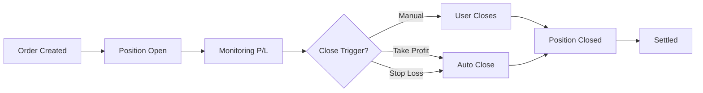

The order management system tracks your positions from creation to closure, providing real-time updates on profit/loss and allowing you to close positions at any time.

## Order Lifecycle

Every order goes through these stages:



<Info>
All open orders are held in-memory in the Engine for instant access and real-time P/L calculations.
</Info>

## Viewing Open Orders

Retrieve all your active positions:

<Tabs>
  <Tab title="Request">
    ```bash
    curl -X GET https://api.exness.com/api/v1/trade/open \
      -H "Authorization: Bearer YOUR_JWT_TOKEN"
    ```
  </Tab>
  <Tab title="Response">
    ```json
    {
      "message": [
        {
          "orderId": "550e8400-e29b-41d4-a716-446655440000",
          "userId": "user-123",
          "symbol": "btc",
          "type": "buy",
          "quantity": 0.1,
          "leverage": 10,
          "openPrice": 43000,
          "currentPrice": 43500,
          "openTime": "2024-03-15T10:30:00.000Z",
          "takeProfit": 45000,
          "stopLoss": 42000,
          "status": "open"
        }
      ]
    }
    ```
  </Tab>
</Tabs>

### Order Details

Each order includes:

| Field | Description |
|-------|-------------|
| `orderId` | Unique identifier for the order |
| `symbol` | Trading pair (btc, eth, sol) |
| `type` | buy or sell |
| `quantity` | Amount traded |
| `leverage` | Leverage multiplier used |
| `openPrice` | Price when order was created |
| `currentPrice` | Live market price (updated in real-time) |
| `openTime` | Timestamp when order opened |
| `takeProfit` | Auto-close price for profits |
| `stopLoss` | Auto-close price for losses |
| `status` | Current order status |

## Fetching Open Orders

The backend retrieves orders from the Engine via Redis Streams:

<CodeGroup>
```typescript Backend Route
// apps/Backend/src/routes/trade.routes.ts
tradeRouter.get("/open", authMiddleware, async (req: Request, res: Response) => {
  const userId = req.user?.id;
  if (!userId) {
    return res.status(401).json({ error: "Unauthorized" });
  }

  const RedisStreams = req.app.locals.redisStreams;
  
  // Request open orders from Engine
  const streamResult = await RedisStreams.addToRedisStream(
    constant.redisStream,
    {
      function: "getOpenOrder",
      userId
    }
  );
  
  const requestId = streamResult?.requestId;

  // Wait for Engine response (5 second timeout)
  const result = await RedisStreams.readNextFromRedisStream(
    constant.secondaryRedisStream,
    5000,
    { requestId }
  );

  if (result && result.function === "getOpenOrder") {
    res.json({
      message: result.message // JSON string of orders
    });
  } else {
    res.json({
      message: JSON.stringify([])
    });
  }
});
```

```typescript Engine Function
// apps/Engine/src/functions/getOpenOrder.ts
export async function getOpenOrderFunction(result: any) {
  // Check if user exists
  if (!users.some((user) => user.userId === result.userId)) {
    await RedisStreams.addToRedisStream(
      constant.secondaryRedisStream,
      {
        function: "getOpenOrder",
        message: JSON.stringify([]),
        requestId: result.requestId
      }
    );
    return;
  }

  // Filter orders for this user
  const userOpenOrders = openOrders.filter(
    (order) => order.userId === result.userId
  );

  // Enhance each order with current price
  const enhancedOrders = userOpenOrders.map((order) => {
    const priceAssetName = getPriceAssetName(order.symbol);
    const priceData = prices.find((p) => 
      p.asset === priceAssetName || 
      p.asset?.toUpperCase() === priceAssetName.toUpperCase()
    );

    // Get current market price
    let currentPrice = order.openPrice;
    if (priceData) {
      // For buy orders: show ask price (cost to buy more)
      // For sell orders: show bid price (cost to sell)
      currentPrice = order.type === "buy" 
        ? priceData.askValue 
        : priceData.bidValue;
    }

    return {
      ...order,
      currentPrice,
      status: "open"
    };
  });

  // Send orders back to Backend
  await RedisStreams.addToRedisStream(
    constant.secondaryRedisStream,
    {
      function: "getOpenOrder",
      message: JSON.stringify(enhancedOrders),
      requestId: result.requestId
    }
  );
}
```
</CodeGroup>

<Tip>
Open orders are stored in-memory for instant access. The Engine updates current prices every 3 seconds from the Price Poller.
</Tip>

## Closing an Order

Close a position to realize profits or losses:

<Tabs>
  <Tab title="Request">
    ```bash
    curl -X POST https://api.exness.com/api/v1/trade/close \
      -H "Authorization: Bearer YOUR_JWT_TOKEN" \
      -H "Content-Type: application/json" \
      -d '{
        "orderId": "550e8400-e29b-41d4-a716-446655440000"
      }'
    ```
  </Tab>
  <Tab title="Success">
    ```json
    {
      "message": "Order closed successfully",
      "order": {
        "orderId": "550e8400-e29b-41d4-a716-446655440000",
        "openPrice": 43000,
        "closePrice": 43500,
        "profitLoss": 50.00,
        "closeTime": "2024-03-15T14:30:00.000Z"
      }
    }
    ```
  </Tab>
  <Tab title="Error">
    ```json
    {
      "error": "Order not found"
    }
    ```
  </Tab>
</Tabs>

## Close Order Processing

When you close an order:

<CodeGroup>
```typescript Backend Route
// apps/Backend/src/routes/trade.routes.ts
tradeRouter.post("/close", authMiddleware, async (req: Request, res: Response) => {
  const { orderId } = req.body;
  const userId = req.user?.id;
  
  if (!orderId) {
    return res.status(400).json({
      error: "Missing required parameters: orderId"
    });
  }

  const RedisStreams = req.app.locals.redisStreams;
  
  // Send close request to Engine
  const streamResult = await RedisStreams.addToRedisStream(
    constant.redisStream,
    {
      function: "createCloseOrder",
      orderId,
      userId
    }
  );
  
  const requestId = streamResult?.requestId;

  // Wait for Engine response
  const result = await RedisStreams.readNextFromRedisStream(
    constant.secondaryRedisStream,
    5000,
    { requestId }
  );

  if (result && result.function === "createCloseOrder") {
    const orderData = JSON.parse(result.message);
    
    if (orderData.error) {
      return res.status(400).json({ error: orderData.error });
    }
    
    res.json({
      message: "Order closed successfully",
      order: orderData
    });
  }
});
```

```typescript Engine Function
// apps/Engine/src/functions/createCloseOrder.ts
export async function createCloseOrderFunction(result: any) {
  // Verify user exists
  if (!users.some((user) => user.userId === result.userId)) {
    return sendError("User not found");
  }

  // Find the order
  const orderIndex = openOrders.findIndex(
    (order) => order.orderId === result.orderId
  );
  
  if (orderIndex === -1) {
    return sendError("Order not found");
  }

  const order = openOrders[orderIndex];

  // Get current market price
  const priceAssetName = getPriceAssetName(order.symbol);
  const priceData = prices.find((p) => 
    p.asset === priceAssetName ||
    p.asset?.toUpperCase() === priceAssetName.toUpperCase()
  );

  if (!priceData) {
    return sendError("Price data not found");
  }

  // Calculate close price
  // For buy orders: close at bid (selling)
  // For sell orders: close at ask (buying back)
  const closePrice = order.type === "buy" 
    ? priceData.bidValue 
    : priceData.askValue;

  // Calculate profit/loss
  let profitLoss: number;
  if (order.type === "buy") {
    // Profit if price went up
    profitLoss = (closePrice - order.openPrice) * order.quantity;
  } else {
    // Profit if price went down
    profitLoss = (order.openPrice - closePrice) * order.quantity;
  }

  // Remove from open orders
  openOrders.splice(orderIndex, 1);

  // Create closed order record
  const closeTime = new Date();
  const orderResult = {
    orderId: order.orderId,
    userId: order.userId,
    symbol: order.symbol,
    type: order.type,
    quantity: order.quantity,
    leverage: order.leverage,
    openPrice: order.openPrice,
    closePrice,
    openTime: order.openTime,
    closeTime,
    profitLoss,
    takeProfit: order.takeProfit || null,
    stopLoss: order.stopLoss || null
  };

  // Send to DBStorage for persistence
  await RedisStreams.addToRedisStream(
    constant.dbStorageStream,
    {
      function: "createCloseOrder",
      message: orderResult
    }
  );

  // Send response to Backend
  await RedisStreams.addToRedisStream(
    constant.secondaryRedisStream,
    {
      function: "createCloseOrder",
      message: JSON.stringify(orderResult),
      requestId: result.requestId
    }
  );
}
```
</CodeGroup>

## Profit/Loss Calculation

The platform calculates P/L based on order type:

### Buy Orders

```typescript
// Profit when price increases
profitLoss = (closePrice - openPrice) × quantity

// Example: Buy 0.1 BTC at $43,000, close at $43,500
profitLoss = (43500 - 43000) × 0.1 = $50
```

### Sell Orders

```typescript
// Profit when price decreases
profitLoss = (openPrice - closePrice) × quantity

// Example: Sell 1 ETH at $2,500, close at $2,400
profitLoss = (2500 - 2400) × 1 = $100
```

<Note>
P/L is calculated without accounting for leverage. Your actual return percentage is multiplied by your leverage.
</Note>

## Viewing Closed Orders

Access your trading history:

<Tabs>
  <Tab title="Request">
    ```bash
    curl -X GET https://api.exness.com/api/v1/trade/close \
      -H "Authorization: Bearer YOUR_JWT_TOKEN"
    ```
  </Tab>
  <Tab title="Response">
    ```json
    {
      "message": [
        {
          "orderId": "550e8400-e29b-41d4-a716-446655440000",
          "symbol": "btc",
          "type": "buy",
          "quantity": 0.1,
          "leverage": 10,
          "openPrice": 43000,
          "closePrice": 43500,
          "openTime": "2024-03-15T10:30:00.000Z",
          "closeTime": "2024-03-15T14:30:00.000Z",
          "profitLoss": 50.00
        }
      ]
    }
    ```
  </Tab>
</Tabs>

<Info>
Closed orders are persisted to the database by the DBStorage service and can be queried at any time.
</Info>

## Take Profit & Stop Loss

Automate your exit strategy with conditional closes:

### Take Profit

Automatically close when price reaches your profit target:

```typescript
// Buy BTC at $43,000 with take profit at $45,000
{
  "symbol": "BTCUSDT",
  "type": "buy",
  "quantity": 0.1,
  "leverage": 10,
  "takeProfit": 45000  // Auto-close when price hits $45,000
}
```

### Stop Loss

Automatically close to limit losses:

```typescript
// Buy BTC at $43,000 with stop loss at $42,000
{
  "symbol": "BTCUSDT",
  "type": "buy",
  "quantity": 0.1,
  "leverage": 10,
  "stopLoss": 42000  // Auto-close when price drops to $42,000
}
```

<Tip>
Always set both take profit and stop loss to manage risk. A common strategy is to set stop loss at 2% and take profit at 4% for a 2:1 risk-reward ratio.
</Tip>

## Order States

| State | Description | Location |
|-------|-------------|----------|
| Open | Active position being monitored | Engine (in-memory) |
| Closed | Position settled, P/L realized | Database (DBStorage) |

## Real-Time Updates

The Engine continuously monitors open orders:

```typescript
// apps/Engine/src/functions/pricePoller.ts
export function pricePollerFunction(result: any) {
  const priceUpdates = JSON.parse(result.message);
  
  // Update global prices array
  priceUpdates.forEach((update: PriceUpdate) => {
    const idx = prices.findIndex((p) => p.asset === update.asset);
    if (idx !== -1) {
      prices[idx] = update;
    } else {
      prices.push(update);
    }
  });
  
  // Check all open orders for take profit / stop loss triggers
  openOrders.forEach((order) => {
    const priceData = prices.find((p) => p.asset === getPriceAssetName(order.symbol));
    if (!priceData) return;
    
    const currentPrice = order.type === "buy" ? priceData.bidValue : priceData.askValue;
    
    // Check take profit
    if (order.takeProfit && currentPrice >= order.takeProfit) {
      createCloseOrderFunction({ orderId: order.orderId, userId: order.userId });
    }
    
    // Check stop loss
    if (order.stopLoss && currentPrice <= order.stopLoss) {
      createCloseOrderFunction({ orderId: order.orderId, userId: order.userId });
    }
  });
}
```

<Info>
Price updates arrive every 3 seconds. The Engine checks all open orders for take profit and stop loss triggers on each update.
</Info>

## Next Steps

<CardGroup cols={2}>
  <Card title="Real-Time Trading" icon="bolt" href="/features/real-time-trading">
    Learn how to place trades with live market data
  </Card>
  <Card title="Market Data" icon="chart-line" href="/features/market-data">
    Access historical data and price charts
  </Card>
</CardGroup>