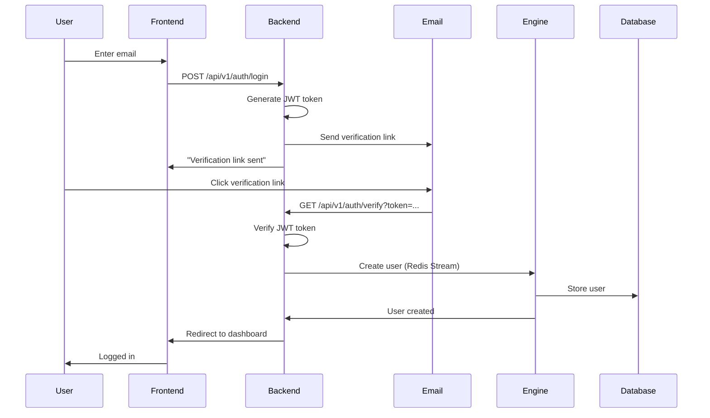

The Exness Trading Platform uses a passwordless authentication system based on JWT (JSON Web Tokens) and email verification. Users receive a magic link via email to access their account securely.

## Authentication Flow

The authentication process follows these steps:



<Info>
The platform uses passwordless authentication for better security and user experience. No passwords means no password breaches.
</Info>

## Login Request

To start the authentication process, submit the user's email:

<Tabs>
  <Tab title="Request">
    ```bash
    curl -X POST https://api.exness.com/api/v1/auth/login \
      -H "Content-Type: application/json" \
      -d '{
        "email": "trader@example.com"
      }'
    ```
  </Tab>
  <Tab title="Response">
    ```json
    {
      "message": "Verification link send",
      "email": "trader@example.com"
    }
    ```
  </Tab>
  <Tab title="Error">
    ```json
    {
      "error": "Email is required"
    }
    ```
  </Tab>
</Tabs>

## Login Implementation

The login endpoint generates a JWT token and sends a verification email:

<CodeGroup>
```typescript Login Route
// apps/Backend/src/routes/auth.routes.ts
import express from "express";
import jwt from "jsonwebtoken";
import { nodemailerSender } from "@repo/utils";
import { v4 as uuidv4 } from "uuid";
import { config } from "@repo/config";

const authRouter = express.Router();
const jwtSecret = config.JWT_SECRET;

authRouter.post("/login", async (req: Request, res: Response) => {
  const { email } = req.body;
  
  // Validate email
  if (!email) {
    return res.status(400).json({ error: "Email is required" });
  }

  // Check JWT secret is configured
  if (!jwtSecret) {
    console.error("JWT_SECRET is not configured");
    return res.status(500).json({ error: "Server configuration error" });
  }

  // Generate unique user ID
  const userId = uuidv4();

  try {
    // Create JWT token with user info
    const token = jwt.sign(
      { userId, email },
      jwtSecret
    );
    
    // Send verification email (production only)
    if (process.env.NODE_ENV === "production") {
      try {
        await nodemailerSender(email, token);
        console.log(`Verification email sent to ${email}`);
      } catch (emailError) {
        console.error("Failed to send verification email:", emailError);
        console.log(`⚠️ Verification link: ${config.BACKEND_URL}/api/v1/auth/verify?token=${token}`);
      }
    } else {
      // In development, log the verification link
      console.log(`🔗 Verification link: ${config.BACKEND_URL}/api/v1/auth/verify?token=${token}`);
    }
    
    res.json({ message: "Verification link send", email });
  } catch (error) {
    console.error("Login error:", error);
    res.status(500).json({ error: "Failed to process login request" });
  }
});
```

```typescript Email Sender
// packages/utils/src/nodemailer/index.ts
import nodemailer from "nodemailer";
import { config } from "@repo/config";

export async function nodemailerSender(email: string, token: string) {
  // Create email transporter
  const transporter = nodemailer.createTransport({
    service: "gmail",
    auth: {
      user: config.EMAIL_USER,
      pass: config.EMAIL_PASSWORD
    }
  });

  // Verification link
  const verificationUrl = `${config.BACKEND_URL}/api/v1/auth/verify?token=${token}`;

  // Send email
  const mailOptions = {
    from: config.EMAIL_USER,
    to: email,
    subject: "Exness Trading Platform - Verify Your Email",
    html: `
      <h2>Welcome to Exness Trading Platform</h2>
      <p>Click the link below to verify your email and access your account:</p>
      <a href="${verificationUrl}" style="
        background-color: #4CAF50;
        color: white;
        padding: 14px 20px;
        text-decoration: none;
        border-radius: 4px;
        display: inline-block;
      ">Verify Email</a>
      <p>This link will expire in 24 hours.</p>
      <p>If you didn't request this, please ignore this email.</p>
    `
  };

  await transporter.sendMail(mailOptions);
}
```
</CodeGroup>

<Note>
In development mode, the verification link is logged to the console instead of being emailed.
</Note>

## Token Verification

When the user clicks the verification link, the backend verifies the token and creates their account:

<CodeGroup>
```typescript Verify Route
// apps/Backend/src/routes/auth.routes.ts
authRouter.get("/verify", async (req: Request, res: Response) => {
  const token = req.query.token as string;
  
  try {
    // Verify JWT token
    const verify = jwt.verify(token, jwtSecret) as jwt.JwtPayload;

    if (verify) {
      const userEmail = verify.email;
      const userId = verify.userId;

      // Send user creation request to Engine
      const RedisStreams = req.app.locals.redisStreams;
      const streamResult = await RedisStreams.addToRedisStream(
        constant.redisStream,
        {
          function: "createUser",
          userId,
          userEmail
        }
      );
      
      const requestId = streamResult?.requestId;

      // Wait for Engine response (5 second timeout)
      const result = await RedisStreams.readNextFromRedisStream(
        constant.secondaryRedisStream,
        5000,
        { requestId }
      );
      
      if (result && result.function === "createUser") {
        if (result.message === userId || result.message === "user Already Exist") {
          // Redirect to dashboard with token
          return res.redirect(
            `${config.FRONTEND_URL}/dashboard?token=${token}`
          );
        }
      }
    }

    return res.status(401).send("Invalid token ❌");
  } catch (err) {
    return res.status(401).send("Token expired or invalid ❌");
  }
});
```

```typescript Create User Function
// apps/Engine/src/functions/createUser.ts
import { v4 as uuid } from "uuid";
import { users } from "../data/users.js";
import { prisma } from "@repo/db";
import { redisStreams, constant } from "@repo/config";

const RedisStreams = redisStreams(config.REDIS_URL);
await RedisStreams.connect();

export async function createUserFunction(result: any) {
  console.log("createUserFunction called with:", result);
  
  // Check if user already exists in memory
  if (users.some((user) => user.userId === result.userId)) {
    console.log("User already exists in memory");
    
    // Send response
    await RedisStreams.addToRedisStream(
      constant.secondaryRedisStream,
      {
        function: "createUser",
        message: "user Already Exist",
        requestId: result.requestId
      }
    );
    return;
  }

  // Create user in database
  try {
    const newUser = await prisma.user.create({
      data: {
        userID: result.userId,
        email: result.userEmail,
        balance: 10000, // Starting balance: $10,000
        createdAt: new Date()
      }
    });
    
    console.log("User created in database:", newUser);
  } catch (dbError) {
    // User might already exist in database
    console.log("User already exists in database:", dbError);
  }

  // Add to in-memory users array
  users.push({
    userId: result.userId,
    email: result.userEmail,
    balance: 10000
  });
  
  console.log("User added to memory. Total users:", users.length);

  // Send success response
  await RedisStreams.addToRedisStream(
    constant.secondaryRedisStream,
    {
      function: "createUser",
      message: result.userId,
      requestId: result.requestId
    }
  );
  
  // Forward to DBStorage for persistence
  await RedisStreams.addToRedisStream(
    constant.dbStorageStream,
    {
      function: "createUser",
      userId: result.userId,
      userEmail: result.userEmail
    }
  );
}
```
</CodeGroup>

<Info>
New users receive a $10,000 demo balance to start trading immediately.
</Info>

## Authentication Middleware

Protected endpoints use the `authMiddleware` to verify JWT tokens:

```typescript
// apps/Backend/src/middleware/auth.ts
import jwt from 'jsonwebtoken';
import { config } from '@repo/config';
import { prisma } from '@repo/db';

interface AuthRequest extends Request {
  user?: {
    id: string;
    email: string;
    firstName?: string;
    lastName?: string;
  };
}

export const authMiddleware = async (
  req: AuthRequest,
  res: Response,
  next: NextFunction
) => {
  try {
    // Extract token from Authorization header
    const authHeader = req.header('Authorization');
    const token = authHeader?.replace('Bearer ', '');
    
    if (!token) {
      return res.status(401).json({ error: 'Access denied. No token provided.' });
    }

    // Verify token
    const decoded = jwt.verify(token, config.JWT_SECRET) as {
      userId: string;
      email: string;
      firstName?: string;
      lastName?: string;
    };

    const userId = decoded.userId;
    if (!userId) {
      return res.status(401).json({ error: 'Invalid token: userId not found.' });
    }

    // Verify user exists in database
    const user = await prisma.user.findFirst({
      where: {
        OR: [
          { userID: userId },
          { email: decoded.email }
        ]
      }
    });

    if (!user) {
      return res.status(401).json({
        error: 'User not found in database. Please login again.'
      });
    }

    // Attach user info to request
    req.user = {
      id: userId,
      email: decoded.email,
      firstName: decoded.firstName,
      lastName: decoded.lastName
    };
    
    next();
  } catch (error) {
    console.error('Auth middleware error:', error);
    res.status(401).json({ error: 'Invalid token.' });
  }
};
```

## Using Protected Endpoints

Include the JWT token in the Authorization header for protected routes:

<Tabs>
  <Tab title="JavaScript">
    ```javascript
    // Store token after login
    const token = new URLSearchParams(window.location.search).get('token');
    localStorage.setItem('authToken', token);

    // Use token in API requests
    async function createTrade(orderData) {
      const token = localStorage.getItem('authToken');
      
      const response = await fetch('https://api.exness.com/api/v1/trade/create', {
        method: 'POST',
        headers: {
          'Authorization': `Bearer ${token}`,
          'Content-Type': 'application/json'
        },
        body: JSON.stringify(orderData)
      });
      
      if (response.status === 401) {
        // Token expired or invalid - redirect to login
        window.location.href = '/login';
        return;
      }
      
      return await response.json();
    }
    ```
  </Tab>
  <Tab title="cURL">
    ```bash
    # Get token from login/verification process
    TOKEN="eyJhbGciOiJIUzI1NiIsInR5cCI6IkpXVCJ9..."

    # Use token in requests
    curl -X POST https://api.exness.com/api/v1/trade/create \
      -H "Authorization: Bearer $TOKEN" \
      -H "Content-Type: application/json" \
      -d '{
        "symbol": "BTCUSDT",
        "type": "buy",
        "quantity": 0.1,
        "leverage": 10
      }'
    ```
  </Tab>
</Tabs>

## Verifying User Existence

Check if a user exists before allowing certain operations:

<Tabs>
  <Tab title="Request">
    ```bash
    curl -X POST https://api.exness.com/api/v1/auth/verify-user \
      -H "Authorization: Bearer YOUR_JWT_TOKEN"
    ```
  </Tab>
  <Tab title="Response">
    ```json
    {
      "success": true,
      "exists": true,
      "message": "User verified and exists in database"
    }
    ```
  </Tab>
</Tabs>

```typescript
// apps/Backend/src/routes/auth.routes.ts
authRouter.post("/verify-user", async (req: Request, res: Response) => {
  try {
    const authHeader = req.header('Authorization');
    const token = authHeader?.replace('Bearer ', '');
    
    if (!token) {
      return res.status(401).json({ error: 'No token provided.' });
    }

    // Verify token
    const verify = jwt.verify(token, jwtSecret) as jwt.JwtPayload;
    
    if (!verify) {
      return res.status(401).json({ error: 'Invalid token.' });
    }

    const userEmail = verify.email;
    const userId = verify.userId;
    
    // Check database
    const user = await prisma.user.findFirst({
      where: {
        OR: [
          { userID: userId },
          { email: userEmail }
        ]
      }
    });

    if (!user) {
      // User doesn't exist - create them
      const RedisStreams = req.app.locals.redisStreams;
      await RedisStreams.addToRedisStream(
        constant.redisStream,
        {
          function: "createUser",
          userId,
          userEmail
        }
      );
      
      return res.status(404).json({
        error: 'User not found in database and creation is in progress.',
        exists: false
      });
    }

    return res.json({
      success: true,
      exists: true,
      message: "User verified and exists in database"
    });
  } catch (err) {
    return res.status(401).json({ error: 'Invalid or expired token.' });
  }
});
```

## Ensuring User Creation

Force user creation if they don't exist:

```bash
curl -X POST https://api.exness.com/api/v1/auth/ensure-user \
  -H "Authorization: Bearer YOUR_JWT_TOKEN"
```

<Note>
This endpoint is useful when a user token is valid but the user hasn't been created in the Engine or database yet.
</Note>

## JWT Token Structure

Tokens contain these claims:

```json
{
  "userId": "550e8400-e29b-41d4-a716-446655440000",
  "email": "trader@example.com",
  "iat": 1710509400,
  "exp": 1710595800
}
```

| Claim | Description |
|-------|-------------|
| `userId` | Unique user identifier (UUID v4) |
| `email` | User's email address |
| `iat` | Issued at timestamp |
| `exp` | Expiration timestamp (optional) |

<Tip>
Tokens don't expire by default. Implement token expiration by adding an `exp` claim when signing the JWT.
</Tip>

## Security Best Practices

1. **Store tokens securely** - Use `localStorage` or `sessionStorage`, never in cookies without `httpOnly` flag
2. **Validate on every request** - The middleware checks token validity and user existence
3. **Handle expired tokens** - Redirect users to login when receiving 401 responses
4. **Use HTTPS** - Always transmit tokens over encrypted connections
5. **Implement token refresh** - Add token expiration and refresh logic for production

## Error Responses

| Status | Error | Cause |
|--------|-------|-------|
| 400 | Email is required | Missing email in login request |
| 401 | Invalid token | Token verification failed |
| 401 | Token expired or invalid | Token is malformed or expired |
| 401 | User not found in database | User doesn't exist (after token verification) |
| 500 | Server configuration error | JWT_SECRET not configured |

## Next Steps

<CardGroup cols={2}>
  <Card title="Real-Time Trading" icon="bolt" href="/features/real-time-trading">
    Start trading after authentication
  </Card>
  <Card title="Order Management" icon="list" href="/features/order-management">
    View and manage your positions
  </Card>
</CardGroup>