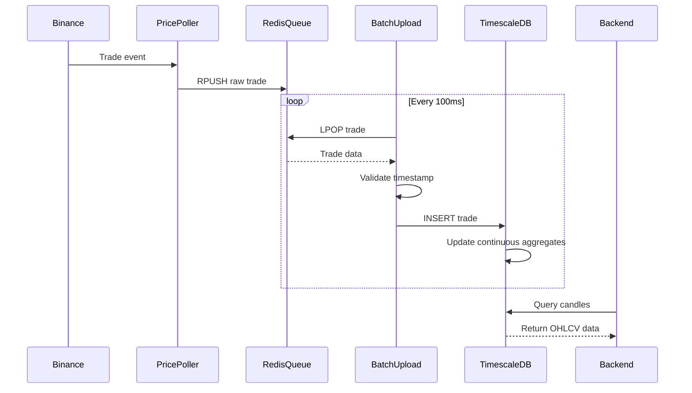

## Overview

The Batch Upload service consumes raw trade data from a Redis queue and efficiently stores it in TimescaleDB. This historical trade data is used to generate candlestick charts at various time intervals (1m, 5m, 15m, 30m, 1h, 4h, 1d) via TimescaleDB's continuous aggregates.

**Location:** `apps/Batch_Upload/src/index.ts:1`

**Database:** TimescaleDB (PostgreSQL extension)

**Data Source:** Redis Queue (populated by Price Poller)

## Key Features

- **High-Throughput Ingestion**: Processes 100+ trades/second
- **Batch Processing**: Configurable batch size for optimal performance
- **TimescaleDB Integration**: Leverages hypertables for time-series optimization
- **Duplicate Prevention**: ON CONFLICT handling for idempotent inserts
- **Timestamp Validation**: Ensures data quality with date range checks
- **Continuous Operation**: Infinite loop with backoff when queue is empty

## Architecture

### Service Initialization

<CodeGroup>
```typescript apps/Batch_Upload/src/index.ts
import { constant, config, redisClient } from "@repo/config";
import "dotenv/config";
import { timeScaleDB } from "@repo/timescaledb";

const db = timeScaleDB();

async function main() {
  // Connect to TimescaleDB
  await db.connect();
  await db.setupTimescale();

  // Connect to Redis Queue
  const RedisClient = redisClient(config.REDIS_URL);
  await RedisClient.connect();

  let BATCH_SIZE = 0;
  const BATCH_LIMIT = 100;

  // Continuous processing loop
  while (true) {
    try {
      const msg = await RedisClient.popData(constant.redisQueue);
      
      if (msg) {
        const trade = JSON.parse(msg);
        await processTrade(trade);
        BATCH_SIZE++;
      } else {
        // Queue empty, wait before checking again
        await new Promise((resolve) => setTimeout(resolve, 100));
      }

      if (BATCH_SIZE >= BATCH_LIMIT) {
        BATCH_SIZE = 0;
      }
    } catch (err) {
      console.error("Error processing trade:", err);
    }
  }
}

main();
```
</CodeGroup>

<Note>
The service uses a simple counter-based batching strategy. While individual INSERTs are executed, TimescaleDB's optimized storage engine handles this efficiently. Future optimization could implement true batch INSERT statements.
</Note>

## Trade Processing

### Data Transformation

<CodeGroup>
```typescript apps/Batch_Upload/src/index.ts
async function processTrade(trade: any) {
  console.log("trade", trade);
  
  // Extract timestamp (handle both microseconds and milliseconds)
  let timestamp = typeof trade.data.T === 'string' 
    ? parseInt(trade.data.T, 10) 
    : trade.data.T;
  
  // Convert microseconds to milliseconds if needed
  // Threshold: milliseconds for year 2100 = 4102444800000
  if (timestamp > 4102444800000) {
    timestamp = Math.floor(timestamp / 1000);
  }
  
  const time = new Date(timestamp);
  
  // Validate timestamp
  if (isNaN(time.getTime()) || time.getFullYear() < 2020 || time.getFullYear() > 2100) {
    console.error(`⚠️ Invalid timestamp for trade: ${trade.data.T}, parsed as: ${time.toISOString()}`);
    console.error(`Full trade data:`, JSON.stringify(trade.data));
    return; // Skip invalid trade
  }
  
  // Extract trade details
  const symbol = trade.data.s;      // e.g., "BTC_USDC_PERP"
  const price = trade.data.p;       // e.g., "96000.00"
  const volume = trade.data.q;      // e.g., "0.5"
  const trade_id = trade.data.t;    // e.g., 1234567890
  const side = trade.data.m ? "sell" : "buy"; // m = is_buyer_maker

  // Insert into TimescaleDB
  await db.getClient().query(
    `INSERT INTO trades (time, symbol, price, volume, trade_id, side)
    VALUES ($1, $2, $3, $4, $5, $6)
    ON CONFLICT DO NOTHING;`,
    [time, symbol, price, volume, trade_id, side]
  );
}
```
</CodeGroup>

### Trade Data Structure

Incoming messages from Binance WebSocket:

<CodeGroup>
```json Binance Trade Message
{
  "data": {
    "s": "BTC_USDC_PERP",     // Symbol
    "p": "96000.00",          // Price
    "q": "0.5",               // Quantity
    "t": 1234567890,          // Trade ID
    "T": 1678901234567,       // Timestamp (milliseconds)
    "m": false                // Is buyer maker (false = buy, true = sell)
  }
}
```
</CodeGroup>

## Database Schema

### Trades Hypertable

<CodeGroup>
```sql TimescaleDB Schema
CREATE TABLE trades (
  time        TIMESTAMPTZ NOT NULL,
  symbol      TEXT NOT NULL,
  price       NUMERIC NOT NULL,
  volume      NUMERIC NOT NULL,
  trade_id    BIGINT NOT NULL,
  side        TEXT NOT NULL,  -- 'buy' or 'sell'
  
  UNIQUE (symbol, trade_id)
);

-- Convert to hypertable (partitioned by time)
SELECT create_hypertable('trades', 'time');

-- Create indexes for fast queries
CREATE INDEX idx_trades_symbol_time ON trades (symbol, time DESC);
CREATE INDEX idx_trades_time ON trades (time DESC);
```
</CodeGroup>

### Continuous Aggregates (Candles)

TimescaleDB automatically maintains materialized views for candlestick data:

<CodeGroup>
```sql 1-Minute Candles
CREATE MATERIALIZED VIEW candles_1m
WITH (timescaledb.continuous) AS
SELECT 
  time_bucket('1 minute', time) AS bucket,
  symbol,
  FIRST(price, time) AS open,
  MAX(price) AS high,
  MIN(price) AS low,
  LAST(price, time) AS close,
  SUM(volume) AS volume,
  COUNT(*) AS trade_count
FROM trades
GROUP BY bucket, symbol;
```

```sql 1-Hour Candles
CREATE MATERIALIZED VIEW candles_1h
WITH (timescaledb.continuous) AS
SELECT 
  time_bucket('1 hour', time) AS bucket,
  symbol,
  FIRST(price, time) AS open,
  MAX(price) AS high,
  MIN(price) AS low,
  LAST(price, time) AS close,
  SUM(volume) AS volume,
  COUNT(*) AS trade_count
FROM trades
GROUP BY bucket, symbol;
```
</CodeGroup>

<Note>
Continuous aggregates are incrementally updated as new trades are inserted, providing efficient O(1) queries for candlestick data regardless of the underlying trade volume.
</Note>

## Data Quality

### Timestamp Validation

The service validates timestamps to prevent corrupt data:

<CodeGroup>
```typescript Validation Rules
// Check 1: Valid JavaScript date
if (isNaN(time.getTime())) {
  console.error(`Invalid timestamp: ${trade.data.T}`);
  return;
}

// Check 2: Reasonable year range (2020-2100)
if (time.getFullYear() < 2020 || time.getFullYear() > 2100) {
  console.error(`Timestamp out of range: ${time.toISOString()}`);
  return;
}

// Check 3: Microsecond to millisecond conversion
if (timestamp > 4102444800000) {
  timestamp = Math.floor(timestamp / 1000);
}
```
</CodeGroup>

### Duplicate Prevention

<CodeGroup>
```sql Idempotent Insert
-- The ON CONFLICT clause ensures duplicate trades are ignored
INSERT INTO trades (time, symbol, price, volume, trade_id, side)
VALUES ($1, $2, $3, $4, $5, $6)
ON CONFLICT DO NOTHING;

-- Conflict occurs when (symbol, trade_id) already exists
```
</CodeGroup>

## Performance Optimization

### Batch Processing Strategy

<CodeGroup>
```typescript Batch Configuration
let BATCH_SIZE = 0;
const BATCH_LIMIT = 100; // Process up to 100 trades before checkpoint

if (BATCH_SIZE >= BATCH_LIMIT) {
  BATCH_SIZE = 0;
  // Future: Could implement COMMIT here if using transactions
}
```
</CodeGroup>

### TimescaleDB Optimizations

<CodeGroup>
```sql Hypertable Configuration
-- Automatically compress old data
SELECT add_compression_policy('trades', INTERVAL '7 days');

-- Automatically drop old data (optional)
SELECT add_retention_policy('trades', INTERVAL '90 days');

-- Refresh continuous aggregates
CALL refresh_continuous_aggregate('candles_1m', NULL, NULL);
```
</CodeGroup>

## Configuration

### Environment Variables

<ParamField path="REDIS_URL" type="string" required>
  Redis connection URL for queue operations
</ParamField>

<ParamField path="TIMESCALE_DB_HOST" type="string" required>
  TimescaleDB host address
</ParamField>

<ParamField path="TIMESCALE_DB_PORT" type="number" default="5432">
  TimescaleDB port
</ParamField>

<ParamField path="TIMESCALE_DB_USER" type="string" required>
  Database user
</ParamField>

<ParamField path="TIMESCALE_DB_PASSWORD" type="string" required>
  Database password
</ParamField>

<ParamField path="TIMESCALE_DB_NAME" type="string" required>
  Database name
</ParamField>

### Performance Tuning

<ParamField path="BATCH_LIMIT" type="number" default="100">
  Number of trades to process before batch checkpoint
</ParamField>

<ParamField path="QUEUE_POLL_INTERVAL" type="number" default="100">
  Milliseconds to wait when queue is empty
</ParamField>

## Deployment

<CodeGroup>
```yaml docker-compose.yml
batch-upload:
  build:
    context: .
    dockerfile: apps/docker/Batch_Upload.Dockerfile
  container_name: exness-batch-upload
  environment:
    REDIS_URL: redis://redis:6379
    TIMESCALE_DB_HOST: timescaledb
    TIMESCALE_DB_PORT: 5432
    TIMESCALE_DB_USER: myuser
    TIMESCALE_DB_PASSWORD: mypassword
    TIMESCALE_DB_NAME: mydb
  depends_on:
    timescaledb:
      condition: service_healthy
    redis:
      condition: service_healthy
  restart: unless-stopped
```
</CodeGroup>

## Data Flow



## Monitoring

### Performance Metrics

<CodeGroup>
```typescript Metrics Tracking
let tradesProcessed = 0;
let tradesSkipped = 0;
let insertErrors = 0;

setInterval(() => {
  console.log({
    tradesProcessed,
    tradesSkipped,
    insertErrors,
    queueSize: await RedisClient.llen(constant.redisQueue),
    uptime: process.uptime()
  });
  tradesProcessed = 0;
  tradesSkipped = 0;
  insertErrors = 0;
}, 60000);
```
</CodeGroup>

### Health Checks

<CodeGroup>
```typescript Database Health
async function healthCheck() {
  try {
    // Check database connection
    const result = await db.getClient().query('SELECT NOW()');
    
    // Check recent data ingestion
    const recentTrades = await db.getClient().query(
      `SELECT COUNT(*) FROM trades WHERE time > NOW() - INTERVAL '5 minutes'`
    );
    
    if (recentTrades.rows[0].count === 0) {
      console.warn('⚠️ No trades in last 5 minutes - possible data pipeline issue');
    }
    
    return { healthy: true };
  } catch (error) {
    console.error('Health check failed:', error);
    return { healthy: false, error };
  }
}

setInterval(healthCheck, 60000);
```
</CodeGroup>

## Error Handling

### Queue Processing Errors

<CodeGroup>
```typescript Error Recovery
try {
  const msg = await RedisClient.popData(constant.redisQueue);
  if (msg) {
    const trade = JSON.parse(msg);
    await processTrade(trade);
  }
} catch (err) {
  console.error("Error processing trade:", err);
  // Log error but continue processing
  // Trade is lost - could implement dead letter queue
}
```
</CodeGroup>

### Database Errors

<CodeGroup>
```typescript Database Error Handling
try {
  await db.getClient().query(
    `INSERT INTO trades (...) VALUES (...) ON CONFLICT DO NOTHING`,
    [time, symbol, price, volume, trade_id, side]
  );
} catch (error: any) {
  if (error.code === '23505') {
    // Unique constraint violation - already exists
    console.log('Duplicate trade skipped:', trade_id);
  } else if (error.code === '23502') {
    // NOT NULL violation
    console.error('Missing required field:', error.column);
  } else {
    console.error('Database insert error:', error);
    // Could implement retry logic or dead letter queue
  }
}
```
</CodeGroup>

## Performance Characteristics

- **Throughput**: 100-500 trades/second (depends on TimescaleDB configuration)
- **Latency**: 10-50ms per trade (queue pop + DB insert)
- **Memory**: ~20MB (minimal buffering)
- **Disk I/O**: ~1 MB/s write throughput (varies by trade frequency)
- **Queue Lag**: Typically less than 1 second under normal load

## Scaling Strategies

### Horizontal Scaling

<Warning>
**Single Consumer Pattern**: The current implementation uses a single consumer (LPOP) which prevents horizontal scaling. To scale, implement consumer groups or partition by symbol.
</Warning>

<CodeGroup>
```typescript Multi-Consumer Pattern
// Option 1: Partition by symbol
const symbols = ['BTC_USDC_PERP', 'ETH_USDC_PERP', 'SOL_USDC_PERP'];
const assignedSymbol = symbols[process.env.WORKER_ID % symbols.length];

// Only process trades for assigned symbol
if (trade.data.s === assignedSymbol) {
  await processTrade(trade);
}

// Option 2: Use Redis Streams instead of queue
const result = await RedisStreams.readNextFromRedisStream(
  'trades-stream',
  0,
  { consumerGroup: 'batch-upload-group', consumerName: 'worker-1' }
);
```
</CodeGroup>

## Related Services

- [Price Poller](/services/price-poller) - Populates the Redis queue
- [Backend API](/services/backend) - Queries candlestick data
- [Database Storage](/services/database-storage) - Stores order data