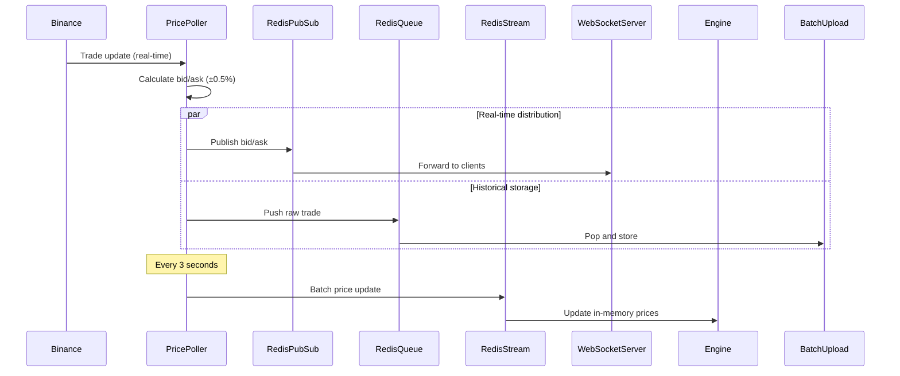

## Overview

The Price Poller service is the market data gateway for the Exness Trading Platform. It connects to Binance's WebSocket API to receive real-time trade data, calculates bid/ask prices with spreads, and distributes this information to other services via Redis Pub/Sub (for real-time updates) and Redis Streams (for Engine processing).

**Location:** `apps/Price_Poller/src/index.ts:1`

**Data Source:** Binance WebSocket API

**Update Frequency:** Real-time trades + 3-second batch updates

## Key Features

- **Real-time Data**: Connects to Binance WebSocket for live trade feeds
- **Multi-channel Distribution**: Publishes via Redis Pub/Sub and Redis Streams
- **Bid/Ask Calculation**: Computes spreads from trade prices (±0.5%)
- **Multiple Assets**: Supports BTC, ETH, SOL perpetual contracts
- **Resilient**: Automatic reconnection on WebSocket failures
- **Batched Updates**: Aggregates and sends updates every 3 seconds

## Architecture

### Service Initialization

<CodeGroup>
```typescript apps/Price_Poller/src/index.ts
import { pubsubClient, config, redisClient } from "@repo/config";
import WebSocket from "ws";
import "dotenv/config";
import { redisStreams, constant } from "@repo/config";
import { type PriceUpdate } from "@repo/types";

// Connect to Binance WebSocket
const ws = new WebSocket(config.BINANCE_WS_URL);

// Connect Redis Pub/Sub
const PubsubClient = pubsubClient(config.REDIS_URL);
await PubsubClient.connect();

// Connect Redis Queue
const RedisClient = redisClient(config.REDIS_URL);
await RedisClient.connect();

// Connect Redis Streams
const RedisStreams = redisStreams(config.REDIS_URL);
await RedisStreams.connect();

const price_updates: PriceUpdate[] = [];
const crypto_trades = ["ETH_USDC_PERP", "SOL_USDC_PERP", "BTC_USDC_PERP"];
let bidAskMap: Record<string, { bid: number; ask: number }> = {};
```
</CodeGroup>

### WebSocket Subscription

<CodeGroup>
```typescript apps/Price_Poller/src/index.ts
ws.on("open", function open() {
  // Subscribe to trade streams for each asset
  crypto_trades.forEach((element) => {
    ws.send(`{"method":"SUBSCRIBE","params":["trade.${element}"],"id":4}`);
  });

  ws.on("message", async (data) => {
    try {
      const msg = JSON.parse(data.toString());

      // 1. Extract trade data
      const decimal = 4;
      const asset = msg.data.s.toString();
      const price = Math.floor(Number(msg.data.p) * 10 ** decimal);
      const bidValue = Math.floor((price - price * 0.005) * 10 ** decimal);
      const askValue = Math.floor((price + price * 0.005) * 10 ** decimal);

      // 2. Push raw trade to Redis queue (for Batch Upload)
      await RedisClient.pushData(constant.redisQueue, JSON.stringify(msg));

      // 3. Send bid/ask to WebSocket clients via Pub/Sub
      if (crypto_trades.includes(asset)) {
        const BidAsk = {
          asset,
          bid: bidValue,
          ask: askValue,
        };
        bidAskMap[asset] = BidAsk;
        await PubsubClient.publish(constant.pubsubKey, JSON.stringify(BidAsk));
      }

      // 4. Update price_updates array
      const idx = price_updates.findIndex((u) => u.asset === asset);
      if (idx !== -1 && price_updates[idx]) {
        price_updates[idx].price = price;
        price_updates[idx].bidValue = bidValue;
        price_updates[idx].askValue = askValue;
        price_updates[idx].decimal = decimal;
      } else {
        price_updates.push({ asset, price, bidValue, askValue, decimal });
      }
    } catch (err) {
      console.error("Error parsing message:", err);
    }
  });
});

ws.on("error", (err) => {
  console.error("WebSocket error:", err);
});
```
</CodeGroup>

### Batch Price Updates

<CodeGroup>
```typescript apps/Price_Poller/src/index.ts
// Send data to Engine via Redis Streams every 3 seconds
setInterval(async () => {
  console.log(JSON.stringify(price_updates));
  await RedisStreams.addToRedisStream(
    constant.redisStream,
    { 
      function: "pricePoller",
      message: JSON.stringify(price_updates) 
    }
  );
}, 3000);
```
</CodeGroup>

<Note>
Price updates are sent to the Engine every 3 seconds via Redis Streams. This allows the Engine to check take profit/stop loss conditions without being overwhelmed by individual trade updates.
</Note>

## Price Calculation

### Bid/Ask Spread Formula

The service calculates bid and ask prices from the trade price with a 0.5% spread on each side:

<CodeGroup>
```typescript Spread Calculation
const decimal = 4; // 4 decimal places for prices
const tradePrice = Number(msg.data.p); // e.g., 96000.00 for BTC

// Convert to integer representation (multiply by 10^4)
const price = Math.floor(tradePrice * Math.pow(10, decimal));
// Example: 96000.00 * 10000 = 960000000

// Calculate bid: 0.5% below trade price
const bidValue = Math.floor((price - price * 0.005) * Math.pow(10, decimal));
// Example: (960000000 - 4800000) * 10000 = 955200000

// Calculate ask: 0.5% above trade price
const askValue = Math.floor((price + price * 0.005) * Math.pow(10, decimal));
// Example: (960000000 + 4800000) * 10000 = 964800000
```
</CodeGroup>

### Why Integer Representation?

Prices are stored as integers to avoid floating-point precision errors:

<CodeGroup>
```typescript Integer Price Benefits
// Problem with floats:
const price1 = 0.1 + 0.2; // 0.30000000000000004 ❌

// Solution with integers:
const price2 = 1000 + 2000; // 3000 ✅
const actualPrice = price2 / 10000; // 0.3 when needed
```
</CodeGroup>

## Data Distribution

### 1. Redis Pub/Sub (Real-time WebSocket)

Published immediately on each trade:

<CodeGroup>
```typescript Pub/Sub Message
const BidAsk = {
  asset: "BTC_USDC_PERP",
  bid: 955200000,  // $95,520.00
  ask: 964800000   // $96,480.00
};

await PubsubClient.publish(
  constant.pubsubKey, 
  JSON.stringify(BidAsk)
);
```
</CodeGroup>

**Consumers:**
- WebSocket Server → Broadcasts to connected clients

### 2. Redis Queue (Historical Storage)

Raw trade data pushed for database storage:

<CodeGroup>
```typescript Queue Message
const rawTrade = {
  data: {
    s: "BTC_USDC_PERP",    // symbol
    p: "96000.00",         // price
    q: "0.5",              // quantity
    t: 1234567890,         // trade ID
    T: 1678901234567,      // timestamp
    m: false               // is_buyer_maker
  }
};

await RedisClient.pushData(
  constant.redisQueue,
  JSON.stringify(rawTrade)
);
```
</CodeGroup>

**Consumers:**
- Batch Upload Service → Stores in TimescaleDB for candle generation

### 3. Redis Streams (Engine Updates)

Batched price updates every 3 seconds:

<CodeGroup>
```typescript Stream Message
const priceUpdates = [
  {
    asset: "BTC_USDC_PERP",
    price: 960000000,
    bidValue: 955200000,
    askValue: 964800000,
    decimal: 4
  },
  {
    asset: "ETH_USDC_PERP",
    price: 35600000,
    bidValue: 35422000,
    askValue: 35778000,
    decimal: 4
  }
];

await RedisStreams.addToRedisStream(
  constant.redisStream,
  {
    function: "pricePoller",
    message: JSON.stringify(priceUpdates)
  }
);
```
</CodeGroup>

**Consumers:**
- Trading Engine → Updates in-memory prices, checks TP/SL triggers

## Supported Assets

<CodeGroup>
```typescript Asset Configuration
const crypto_trades = [
  "ETH_USDC_PERP",  // Ethereum Perpetual
  "SOL_USDC_PERP",  // Solana Perpetual
  "BTC_USDC_PERP"   // Bitcoin Perpetual
];
```
</CodeGroup>

### Adding New Assets

To support additional trading pairs:

1. Add the Binance symbol to `crypto_trades` array
2. Ensure the symbol exists on Binance WebSocket API
3. Update the supported assets in Backend service
4. Deploy and restart the Price Poller

<CodeGroup>
```typescript Adding New Asset
const crypto_trades = [
  "ETH_USDC_PERP",
  "SOL_USDC_PERP",
  "BTC_USDC_PERP",
  "AVAX_USDC_PERP"  // New asset
];
```
</CodeGroup>

## Error Handling

### WebSocket Reconnection

<CodeGroup>
```typescript WebSocket Error Handling
ws.on("error", (err) => {
  console.error("WebSocket error:", err);
  // Implement exponential backoff reconnection
  setTimeout(() => {
    console.log("Attempting to reconnect...");
    reconnect();
  }, 5000);
});

ws.on("close", () => {
  console.log("WebSocket connection closed");
  setTimeout(() => reconnect(), 5000);
});

function reconnect() {
  const ws = new WebSocket(config.BINANCE_WS_URL);
  // Re-subscribe to all streams
  crypto_trades.forEach((symbol) => {
    ws.send(`{"method":"SUBSCRIBE","params":["trade.${symbol}"],"id":4}`);
  });
}
```
</CodeGroup>

### Message Parsing Errors

<CodeGroup>
```typescript Message Error Handling
ws.on("message", async (data) => {
  try {
    const msg = JSON.parse(data.toString());
    
    // Validate message structure
    if (!msg.data || !msg.data.s || !msg.data.p) {
      console.warn("Invalid message format:", msg);
      return;
    }
    
    // Process message...
  } catch (err) {
    console.error("Error parsing message:", err);
    // Continue processing other messages
  }
});
```
</CodeGroup>

## Configuration

### Environment Variables

<ParamField path="BINANCE_WS_URL" type="string" required>
  Binance WebSocket API endpoint (e.g., wss://stream.binance.com:9443/ws)
</ParamField>

<ParamField path="REDIS_URL" type="string" required>
  Redis connection URL for pub/sub, queue, and streams
</ParamField>

### Redis Configuration

<ParamField path="constant.pubsubKey" type="string" default="exness:price-updates">
  Redis Pub/Sub channel for real-time price broadcasts
</ParamField>

<ParamField path="constant.redisQueue" type="string" default="exness:trade-queue">
  Redis queue for raw trade data
</ParamField>

<ParamField path="constant.redisStream" type="string" default="exness:engine-stream">
  Redis stream for Engine price updates
</ParamField>

## Deployment

<CodeGroup>
```yaml docker-compose.yml
price-poller:
  build:
    context: .
    dockerfile: apps/docker/Price_Poller.Dockerfile
  container_name: exness-price-poller
  environment:
    REDIS_URL: redis://redis:6379
    BINANCE_WS_URL: wss://stream.binance.com:9443/ws
  depends_on:
    redis:
      condition: service_healthy
  restart: unless-stopped
```
</CodeGroup>

<Warning>
**External Dependency**: This service relies on Binance's WebSocket API. If Binance is down or rate-limits connections, the entire platform loses price feeds. Consider implementing:
- Multiple data source failover (e.g., Coinbase, Kraken)
- Price cache with staleness detection
- Circuit breaker pattern for API failures
</Warning>

## Data Flow



## Performance Characteristics

- **Message Rate**: 10-100 trades/second per asset (varies by market activity)
- **Latency**: Less than 50ms from Binance trade to Redis publish
- **Memory**: ~10MB (price cache for 3 assets)
- **CPU**: Less than 5% (message parsing and forwarding)
- **Network**: ~1 KB/s outbound to Redis

## Monitoring

### Health Checks

<CodeGroup>
```typescript Health Monitoring
let lastUpdateTime = Date.now();
let messageCount = 0;

ws.on("message", async (data) => {
  messageCount++;
  lastUpdateTime = Date.now();
  // Process message...
});

// Staleness detection
setInterval(() => {
  const timeSinceUpdate = Date.now() - lastUpdateTime;
  if (timeSinceUpdate > 30000) {
    console.error(`No price updates for ${timeSinceUpdate}ms - possible connection issue`);
    // Trigger alert or reconnection
  }
  console.log(`Messages processed: ${messageCount}`);
  messageCount = 0;
}, 60000);
```
</CodeGroup>

## Testing

### Mock Binance WebSocket

<CodeGroup>
```typescript Test Mock
import { WebSocketServer } from 'ws';

// Create mock Binance server
const mockServer = new WebSocketServer({ port: 9443 });

mockServer.on('connection', (socket) => {
  // Send mock trade every second
  setInterval(() => {
    const mockTrade = {
      data: {
        s: "BTC_USDC_PERP",
        p: "96000.00",
        q: "0.5",
        t: Date.now(),
        T: Date.now(),
        m: false
      }
    };
    socket.send(JSON.stringify(mockTrade));
  }, 1000);
});
```
</CodeGroup>

## Related Services

- [WebSocket Server](/services/websocket-server) - Delivers prices to clients
- [Trading Engine](/services/engine) - Uses prices for order execution
- [Batch Upload](/services/batch-upload) - Stores raw trades
- [Database Storage](/services/database-storage) - Historical price queries