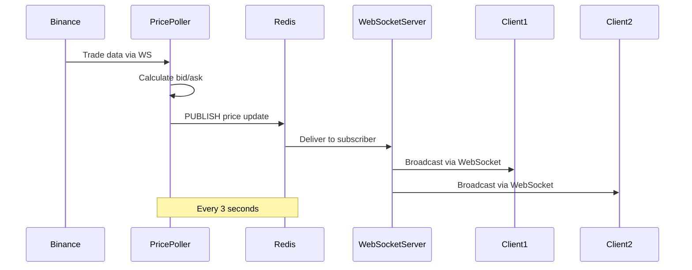

## Overview

The WebSocket Server provides real-time bidirectional communication between the Exness Trading Platform and connected clients. It subscribes to Redis Pub/Sub channels and pushes live price updates (bid/ask spreads) to all connected WebSocket clients, enabling real-time chart updates and price displays.

**Location:** `apps/Websocket_Server/src/index.ts:1`

**Port:** 7070

**Protocol:** WebSocket (ws://)

## Key Features

- **Real-time Price Updates**: Sub-second latency for bid/ask price changes
- **Redis Pub/Sub Integration**: Subscribes to price update channels
- **Multiple Client Support**: Broadcasts to all connected clients simultaneously
- **Lightweight**: Minimal processing overhead, pure message forwarding
- **Auto-reconnect**: Handles Redis and WebSocket connection failures gracefully

## Architecture

### Service Initialization

<CodeGroup>
```typescript apps/Websocket_Server/src/index.ts
import "dotenv/config";
import { WebSocketServer } from "ws";
import { config, pubsubClient, constant } from "@repo/config";

// Create WebSocket Server
const wss = new WebSocketServer({ port: config.WEBSOCKET_PORT });

// Connect Redis Pub/Sub
const PubsubClient = pubsubClient(config.REDIS_URL);
await PubsubClient.connect();

wss.on("connection", async (socket) => {
  console.log("Client connected");

  // Subscribe to Redis pubsub and send to frontend
  await PubsubClient.subscriber(constant.pubsubKey, (data: any) => {    
    socket.send(JSON.stringify(data));
  });

  socket.on("close", () => {
    console.log("Client disconnected");
  });
});
```
</CodeGroup>

<Note>
The WebSocket Server is a pure relay service - it forwards messages from Redis Pub/Sub to connected WebSocket clients without any transformation or business logic.
</Note>

## Message Format

### Price Update Message

Clients receive JSON messages with the following structure:

<CodeGroup>
```json Example Price Update
{
  "asset": "BTC_USDC_PERP",
  "bid": 958500000,
  "ask": 967500000
}
```
</CodeGroup>

<ParamField path="asset" type="string">
  Trading pair identifier (e.g., BTC_USDC_PERP, ETH_USDC_PERP, SOL_USDC_PERP)
</ParamField>

<ParamField path="bid" type="number">
  Bid price in smallest unit (multiply by 10^-decimal for actual price)
</ParamField>

<ParamField path="ask" type="number">
  Ask price in smallest unit (multiply by 10^-decimal for actual price)
</ParamField>

### Price Calculation

Prices are stored as integers to avoid floating-point precision issues:

<CodeGroup>
```typescript Price Conversion Example
// Received message
const message = {
  asset: "BTC_USDC_PERP",
  bid: 958500000,
  ask: 967500000
};

// Convert to actual price (decimal = 4)
const decimal = 4;
const actualBid = message.bid / Math.pow(10, decimal);
const actualAsk = message.ask / Math.pow(10, decimal);

console.log(`BTC Bid: $${actualBid}`); // BTC Bid: $95850.0000
console.log(`BTC Ask: $${actualAsk}`); // BTC Ask: $96750.0000
```
</CodeGroup>

## Client Integration

### JavaScript/TypeScript Example

<CodeGroup>
```typescript Client Connection
const ws = new WebSocket('ws://localhost:7070');

ws.onopen = () => {
  console.log('Connected to Exness WebSocket Server');
};

ws.onmessage = (event) => {
  const priceUpdate = JSON.parse(event.data);
  console.log('Price Update:', priceUpdate);
  
  // Update UI with new bid/ask prices
  updatePriceDisplay(priceUpdate.asset, priceUpdate.bid, priceUpdate.ask);
};

ws.onerror = (error) => {
  console.error('WebSocket error:', error);
};

ws.onclose = () => {
  console.log('Disconnected from WebSocket Server');
  // Implement reconnection logic
  setTimeout(() => reconnect(), 5000);
};
```
</CodeGroup>

### React Hook Example

<CodeGroup>
```typescript useWebSocket Hook
import { useEffect, useState } from 'react';

interface PriceUpdate {
  asset: string;
  bid: number;
  ask: number;
}

export function useWebSocket(url: string) {
  const [prices, setPrices] = useState<Record<string, PriceUpdate>>({});
  const [connected, setConnected] = useState(false);

  useEffect(() => {
    const ws = new WebSocket(url);

    ws.onopen = () => {
      console.log('WebSocket connected');
      setConnected(true);
    };

    ws.onmessage = (event) => {
      const update: PriceUpdate = JSON.parse(event.data);
      setPrices((prev) => ({
        ...prev,
        [update.asset]: update,
      }));
    };

    ws.onerror = (error) => {
      console.error('WebSocket error:', error);
    };

    ws.onclose = () => {
      console.log('WebSocket disconnected');
      setConnected(false);
    };

    return () => {
      ws.close();
    };
  }, [url]);

  return { prices, connected };
}

// Usage in component
function PriceDisplay() {
  const { prices, connected } = useWebSocket('ws://localhost:7070');

  return (
    <div>
      <div>Status: {connected ? 'Connected' : 'Disconnected'}</div>
      {Object.entries(prices).map(([asset, price]) => (
        <div key={asset}>
          {asset}: Bid {price.bid} / Ask {price.ask}
        </div>
      ))}
    </div>
  );
}
```
</CodeGroup>

## Data Flow



## Configuration

### Environment Variables

<ParamField path="WEBSOCKET_PORT" type="number" default="7070">
  WebSocket server listening port
</ParamField>

<ParamField path="REDIS_URL" type="string" required>
  Redis connection URL for pub/sub
</ParamField>

### Redis Pub/Sub Configuration

<CodeGroup>
```typescript Pub/Sub Channel
import { constant } from "@repo/config";

// The service subscribes to this channel
const pubsubChannel = constant.pubsubKey; // "exness:price-updates"
```
</CodeGroup>

## Deployment

### Docker Configuration

<CodeGroup>
```yaml docker-compose.yml
websocket-server:
  build:
    context: .
    dockerfile: apps/docker/Websocket_Server.Dockerfile
  container_name: exness-websocket-server
  environment:
    REDIS_URL: redis://redis:6379
    WEBSOCKET_PORT: 7070
  ports:
    - "7070:7070"
  depends_on:
    redis:
      condition: service_healthy
  restart: unless-stopped
```
</CodeGroup>

### Production Considerations

<Warning>
**Security**: The current implementation uses unencrypted WebSocket (ws://). For production, implement WSS (WebSocket Secure) with TLS certificates.
</Warning>

<CodeGroup>
```typescript WSS Example
import { WebSocketServer } from 'ws';
import https from 'https';
import fs from 'fs';

const server = https.createServer({
  cert: fs.readFileSync('/path/to/cert.pem'),
  key: fs.readFileSync('/path/to/key.pem')
});

const wss = new WebSocketServer({ server });

server.listen(7070);
```
</CodeGroup>

## Performance Characteristics

- **Latency**: Less than 10ms from Redis publish to WebSocket send
- **Throughput**: 1000+ messages/second per connection
- **Concurrent Connections**: Limited by system resources (typically 10,000+)
- **Message Size**: ~80 bytes per price update (JSON)
- **Update Frequency**: Every 3 seconds per asset

## Monitoring and Health Checks

### Connection Tracking

<CodeGroup>
```typescript Connection Monitoring
const wss = new WebSocketServer({ port: config.WEBSOCKET_PORT });

let connectionCount = 0;

wss.on("connection", async (socket) => {
  connectionCount++;
  console.log(`Client connected. Total connections: ${connectionCount}`);

  socket.on("close", () => {
    connectionCount--;
    console.log(`Client disconnected. Total connections: ${connectionCount}`);
  });
});

// Health check endpoint (if using HTTP server)
app.get('/health', (req, res) => {
  res.json({
    status: 'healthy',
    connections: connectionCount,
    uptime: process.uptime()
  });
});
```
</CodeGroup>

## Error Handling

### Redis Disconnection

<CodeGroup>
```typescript Redis Reconnection
const PubsubClient = pubsubClient(config.REDIS_URL);

PubsubClient.on('error', (err) => {
  console.error('Redis Pub/Sub error:', err);
});

PubsubClient.on('reconnecting', () => {
  console.log('Reconnecting to Redis...');
});

PubsubClient.on('ready', () => {
  console.log('Redis Pub/Sub ready');
});
```
</CodeGroup>

### WebSocket Error Handling

<CodeGroup>
```typescript WebSocket Error Handling
wss.on("connection", async (socket) => {
  socket.on('error', (error) => {
    console.error('WebSocket client error:', error);
  });
  
  socket.on('close', (code, reason) => {
    console.log(`Client disconnected: ${code} - ${reason}`);
  });
  
  // Heartbeat to detect broken connections
  const heartbeat = setInterval(() => {
    if (socket.readyState === WebSocket.OPEN) {
      socket.ping();
    } else {
      clearInterval(heartbeat);
    }
  }, 30000);
});
```
</CodeGroup>

## Scaling Considerations

### Horizontal Scaling

The WebSocket Server can be horizontally scaled by running multiple instances behind a load balancer:

<CodeGroup>
```nginx nginx.conf
upstream websocket {
    ip_hash;  # Sticky sessions for WebSocket
    server ws-server-1:7070;
    server ws-server-2:7070;
    server ws-server-3:7070;
}

server {
    listen 80;
    
    location / {
        proxy_pass http://websocket;
        proxy_http_version 1.1;
        proxy_set_header Upgrade $http_upgrade;
        proxy_set_header Connection "upgrade";
        proxy_set_header Host $host;
    }
}
```
</CodeGroup>

<Note>
Each WebSocket Server instance independently subscribes to the same Redis Pub/Sub channel, ensuring all connected clients receive updates regardless of which instance they're connected to.
</Note>

## Testing

### Manual Testing with wscat

<CodeGroup>
```bash Terminal
# Install wscat
npm install -g wscat

# Connect to WebSocket Server
wscat -c ws://localhost:7070

# You should start receiving price updates
# Example output:
# < {"asset":"BTC_USDC_PERP","bid":958500000,"ask":967500000}
# < {"asset":"ETH_USDC_PERP","bid":35240000,"ask":35590000}
```
</CodeGroup>

### Automated Testing

<CodeGroup>
```typescript WebSocket Test
import { WebSocket } from 'ws';

test('WebSocket server delivers price updates', (done) => {
  const ws = new WebSocket('ws://localhost:7070');
  
  ws.on('open', () => {
    console.log('Connected to WebSocket server');
  });
  
  ws.on('message', (data) => {
    const message = JSON.parse(data.toString());
    expect(message).toHaveProperty('asset');
    expect(message).toHaveProperty('bid');
    expect(message).toHaveProperty('ask');
    ws.close();
    done();
  });
  
  // Timeout after 10 seconds
  setTimeout(() => {
    ws.close();
    done(new Error('Timeout waiting for price update'));
  }, 10000);
});
```
</CodeGroup>

## Related Services

- [Price Poller](/services/price-poller) - Publishes price updates to Redis
- [Backend API](/services/backend) - Provides REST API for historical data
- [Trading Engine](/services/engine) - Uses prices for order execution